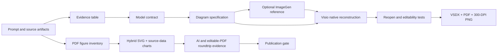

# Codex Scientific Diagram Visio

<p align="right">
  <strong>English</strong> | <a href="README.zh-CN.md">简体中文</a>
</p>

Turn model code, paper descriptions, PDFs, source data, and legacy figures into editable scientific diagrams with evidence-backed QA.

The project separates scientific truth from visual design:

```text
Prompt + code + manuscript + old figure
                ↓
Evidence audit and tensor-shape contract
                ↓
Image-generated visual reference (optional)
                ↓
Native Visio reconstruction and local revision
                ↓
Reopen/editability QA + VSDX/PDF/300-DPI PNG
```

For dense multi-panel paper figures, the third skill follows a parallel path: inventory the PDF, classify editable geometry versus scientific pixels, rebuild live text and vectors, preserve necessary image evidence as minimal atoms, then verify SVG/AI/editable-PDF roundtrips and publication blockers.

The generated image is a design reference, never the source of truth. Executed model shapes, training code, configuration, and manuscript equations are reconciled before drawing.

## Live workflow demo

This real Microsoft Visio capture shows Codex reading a verified Transformer Encoder contract, generating a style reference, constructing the figure from native shapes, reopening the VSDX, and selecting editable objects.


[Open the reproducible example](examples/transformer-encoder-demo/) · [Download the editable VSDX](examples/transformer-encoder-demo/assets/transformer-encoder-demo.vsdx) · [View PDF](examples/transformer-encoder-demo/assets/transformer-encoder-demo.pdf)

[Model and usage example](examples/transformer-encoder-demo/COST-EXAMPLE.md): approximately **$0.32 API-equivalent cost** for the documented `gpt-5.6-terra` + one medium `gpt-image-2` reference + local Visio scenario. Subscription message limits are not a fixed token-to-credit conversion.

## Paper figure reconstruction demo

This v1.3.2 animation uses real reconstructed artifacts and audit values: a ten-panel hybrid biological figure, an editable statistical suite, bounded OCR cleanup evidence, and three-stage Illustrator reopen counts. It is an evidence-driven presentation, not an Illustrator screen recording.


[Open the reconstruction example](examples/paper-figure-reconstruction-demo/) · [Watch MP4](examples/paper-figure-reconstruction-demo/assets/paper-figure-reconstruction-demo.mp4) · [Inspect evidence JSON](examples/paper-figure-reconstruction-demo/assets/simpli-figure4-evidence.json)

## Why this exists

Scientific architecture figures often look polished while silently misrepresenting projection direction, fusion semantics, tensor dimensions, classifier width, or class count. This plugin adds an evidence gate before visual work and an editability gate after Visio export.

## Supported research domains and figure families

"Supported" means the workflow can classify the panel, choose an evidence-preserving reconstruction route, and produce an editable specification or artifact. It does not mean that every figure can be converted losslessly from pixels: source data, calibration, and human scientific review still determine whether a result is publication-ready.

| Research domain | Figure families covered | Current reconstruction route |
|---|---|---|
| AI, machine learning, and computer vision | Neural-network architectures, Transformer/CNN/U-Net and encoder-decoder flows, multimodal pipelines, feature maps, residual/skip paths, detection boxes, classes, confidence labels, keypoints, segmentation masks, depth and probability-map panels | Native Visio for architecture geometry; hybrid SVG for image-bearing qualitative results |
| Statistics and data science | Line, scatter, fitted curve, error-bar, bar, box, violin, ROC, Kaplan-Meier, forest, risk table, heatmap, confusion/correlation matrix, PCA, t-SNE, clustering dendrogram, network, phylogenetic tree, and Circos-style ring figures | Full vector when PDF objects or source data exist; approximate digitization must be labelled as such |
| Clinical and biomedical research | Clinical flow diagrams, survival and forest figures, flow-cytometry gates, CT/MRI/PET/ultrasound overlays, histology and whole-slide annotations | Vector labels, gates, ROIs, scales, and legends over immutable scientific-image atoms |
| Cell, molecular, and omics research | Fluorescence/confocal microscopy, multiplex imaging, Western blot, electrophoresis, genomic heatmaps, phylogenetic figures, protein/ligand render annotations | Preserve intensity, tissue, band, or molecular-render pixels; rebuild annotations and data-bound plots |
| Chemistry, materials, and electrochemistry | Chemical structures and reaction schemes; XRD, Raman, FTIR, XPS, mass-spectrometry and chromatography curves; DSC/TGA/DTA; CV/EIS/Nyquist; SEM/TEM/AFM/EDS panels | Vector curves, peaks, axes, bonds, arrows, conditions, scales, and callouts; instrument pixels remain raster when necessary |
| Mechanical, electrical, and physical engineering | Circuit/control/wiring diagrams, FEA stress/strain fields, CFD velocity/pressure/streamlines, 3D response surfaces and contours, CAD/exploded assemblies | Vector framework, symbols, dimensions, leaders, boundaries, and color bars around retained continuous fields or renders |
| Experimental systems and microfluidics | Experimental setups, process principles, channels, layers, flow paths, sensors, device photos, and mixed photo + schematic + plot composites | Editable framework with minimal atomic photos/microscopy regions and explicit measurement blockers |
| Earth science and geospatial research | GIS and remote-sensing maps, land-cover panels, terrain/DEM, geology and seismic maps, faults, epicenters, sections, graticules, north arrows, scales, and legends | Editable map overlays around retained satellite, terrain, or continuous raster evidence |

Recovery is recorded per panel as `R0` native PDF geometry, `R1` source-data regeneration, `R2` approximate digitization, or `R3` immutable scientific pixels. A mixed figure may use several recovery levels at once.

## Drawable objects, symbols, and scientific icons

The repository does not depend on a closed icon library. It constructs reusable, editable scientific components from explicit vector primitives and semantic IDs.

| Component family | Drawable objects and icons |
|---|---|
| Core vector primitives | Rectangle and rounded rectangle, ellipse and circle, triangle and quadrilateral, polygon, line, polyline, cubic/arc path, open/closed arc, annular sector, nested group, linear/radial gradient, live straight text, curved path text, subscript and superscript runs |
| Flow and relationship symbols | Straight and orthogonal arrows, glued connectors, double-headed dimension/spread arrows, branch, merge, residual/skip path, feedback/return path, leader, bracket, boundary, ROI box, dashed enclosure, junction and checkpoint |
| AI/model architecture components | Editable 3D tensor/feature-map cuboids, input/output blocks, encoder/decoder stages, projection and weight matrices, bias/vector blocks, attention, normalization, convolution/pooling modules, classifier heads, parallel branches and multimodal fusion |
| Mathematical operators | Independent `×`, `+`, `Σ`, concatenation `‖`, arrows, equality and formula text; matrices, dimensions, Greek letters, primes, subscripts and superscripts remain separately editable |
| Statistical mini-plots | Definition-driven mean, variance, skewness and kurtosis icons; axes, ticks, gridlines, markers, error bars, confidence intervals, censor marks, fitted curves, legends, significance brackets and p-value labels |
| Matrix, network, and circular components | Heatmap cells, confusion/correlation cells, dendrogram branches, graph nodes/edges, phylogenetic branches, concentric rings, annular sectors, circular labels and color bars |
| Image and measurement overlays | Panel letters, channel labels, scale bars, orientation marks, ROI polygons, segmentation boundaries, gates/quadrants, arrows, keypoints, class/confidence labels, peak markers and reference lines |
| Apparatus and engineering components | Process containers, pipes/channels, flow arrows, circuit wires, junctions, instrument blocks, boundary/load arrows, dimension lines, section markers, exploded-view leaders and BOM identifiers |
| Chemistry and molecular components | Bonds, rings, stereochemical wedges, reaction arrows, condition/yield text, residue/ligand labels and dashed interaction bonds can be composed as vectors; a chemistry-aware ChemDraw/RDKit backend is not yet included |
| Map components | Boundaries, points, section lines, graticules, north arrows, scale bars, legends, fault traces and epicenter symbols; coordinate-aware GIS import is not yet included |

## Drawing and authoring tools

| Tool/backend | What this repository can do now | Validation status |
|---|---|---|
| Microsoft Visio | Open and control Visio on Windows, create native shapes/groups/connectors, save VSDX, reopen objects, validate glue/fidelity, and export SVG/PDF/PNG | **Native runtime validated** with desktop Visio 16.0 |
| Adobe Illustrator | Run JSX helpers for SVG import, AI save/reopen, editable-PDF export/reopen, object/font/path audits, and constrained path-text repair | **Roundtrip validated** on Windows with Illustrator 29.8.2 |
| SVG + editable PDF | Generate portable editable SVG, hybrid vector/raster assemblies, live text, physical sizing, hashes, and structural audits without Visio | **Portable core implemented**; final editor inspection remains required |
| draw.io / diagrams.net | Convert the supported SVG subset to an editable `mxGraphModel` with stable IDs, layers, plain text, connectors, manifests, and fail-closed auditing | **Structural adapter implemented**; live import/save/reopen validation is still pending |
| Scientific Illustrator | Produce backend-neutral scenes compatible with framework-heavy drawing workflows and use its documented draw.io/PowerPoint direction | **Integration contract documented**; its runtime is not bundled or claimed as validated here |
| PowerPoint / WPS | Can be used as an intermediate framework editor through Scientific Illustrator-compatible workflows | **No direct controller yet**; publication acceptance must return to SVG/Illustrator QA |
| Inkscape, Figma, Affinity Designer, CorelDRAW | May open exported SVG/PDF depending on their own compatibility | **Not currently automated or regression-tested** |
| ChemDraw/RDKit, PyMOL/ChimeraX, CAD/GIS tools | Identified as domain-specific future backends for chemistry, molecular rendering, assemblies, and maps | **Planned, not implemented** |

## What still needs improvement

1. **More real regression figures:** add redistributable golden examples for every major figure family, not only model architecture, biomedical hybrid reconstruction, and the current statistical suite.
2. **Native draw.io and PowerPoint/WPS verification:** complete visible create/edit/save/close/reopen tests and record stable-object evidence before promoting these backends to validated.
3. **Domain-aware adapters:** add ChemDraw/RDKit, PyMOL/ChimeraX, CAD and GIS bridges so domain semantics are preserved instead of approximated from generic paths.
4. **Broader editor coverage:** test additional Illustrator versions and operating systems, then add Inkscape/Figma/Affinity import and editability matrices.
5. **Stronger source-data plotting:** expand deterministic chart builders, statistical-method parity checks, source-row provenance, and missing-data diagnostics.
6. **Reviewed OCR ergonomics:** add a visual approval interface for detection, mask correction, protected-region review, and before/after sign-off; automatic acceptance must remain disabled.
7. **Visual regression automation:** add render comparisons, overlap/text-clipping checks, font substitution detection, and golden-image thresholds alongside structural audits.
8. **Batch and recovery workflow:** support resumable multi-figure jobs, per-panel status dashboards, cache reuse, and artifact manifests without weakening workspace boundaries.
9. **Release engineering:** expand the CI matrix across Python/Windows/Linux, attach signed/checksummed packages to GitHub Releases, and test clean installation in supported Codex clients.

## Included skills

### `scientific-model-diagram-prompting`

- Inspect model code, configuration, manuscript text, screenshots, and old diagrams.
- Freeze stage order, operations, symbols, tensor dimensions, and class labels.
- Generate or revise a visual reference with definition-driven scientific icons.
- Produce a structured native-vector reconstruction specification.

### `scientific-model-diagram-visio`

- Rebuild or locally revise figures in Microsoft Visio.
- Use native editable containers, cuboids, operators, labels, and glued connectors.
- Enforce horizontal parallel branches, readable typography, consistent spacing, and collision-free routing.
- Reopen the VSDX, test independent object editability, and export PDF plus 300-DPI PNG.
- Inspect VSDX package structure with a bundled standard-library Python script.

### `reconstruct-paper-figures`

- Inventory PDF text, vectors, images, placements, captions, and effective PPI before editing.
- Rebuild live text and editable SVG geometry while retaining continuous-tone scientific evidence as minimal, hash-bound image atoms.
- Reconstruct statistical plots from publisher source data without inventing absent groups or observations.
- Apply only reviewed OCR cleanup plans, audit every changed pixel, and keep human approval mandatory.
- Bind SVG import, Illustrator AI reopen, and editable-PDF reopen to machine-readable object and hash evidence.
- Export draw.io/Visio framework geometry where appropriate while keeping Illustrator acceptance separate.

## Requirements

- Codex with Agent Skills support.
- Windows and Microsoft Visio for native VSDX construction and GUI verification.
- Python 3.8+ for the portable skill scripts; PDF inventory and rendering features require the optional PDF packages documented by the skill.
- Adobe Illustrator is optional and needed only for the validated AI/editable-PDF roundtrip workflow (tested with Illustrator 29.8.2 on Windows).
- Image generation is optional; the Visio workflow can start from a verified written specification.

## Install

Install the versioned Codex plugin from this repository marketplace:

```powershell
codex plugin marketplace add CeobeFA333/codex-scientific-diagram-visio --ref v1.3.2
codex plugin add codex-scientific-diagram-visio@ceobefa-scientific-tools
```

Restart the Codex or ChatGPT desktop app and start a new thread. For a group rollout, send members the [bilingual trial guide](TEAM-TRIAL.md) or the `team-trial` ZIP attached to the release.

Alternative Agent Skills installation:

Install all three skills with the open Agent Skills CLI:

```bash
npx skills add CeobeFA333/codex-scientific-diagram-visio
```

Or install a single skill in Codex from its GitHub directory:

```text
$skill-installer install https://github.com/CeobeFA333/codex-scientific-diagram-visio/tree/main/skills/scientific-model-diagram-prompting

$skill-installer install https://github.com/CeobeFA333/codex-scientific-diagram-visio/tree/main/skills/scientific-model-diagram-visio

$skill-installer install https://github.com/CeobeFA333/codex-scientific-diagram-visio/tree/main/skills/reconstruct-paper-figures
```

Restart Codex after installation so the skills are discovered.

## Example prompts

Analyze before drawing:

```text
Use $scientific-model-diagram-prompting to compare my PyTorch model,
experiment config, manuscript equations, and old architecture figure.
Return the authoritative model contract, dimensional audit, and a
publication-ready visual-reference prompt.
```

Build a new editable figure:

```text
Use $scientific-model-diagram-visio to rebuild this verified model contract
as a native editable VSDX. Keep four parallel branches perfectly horizontal,
use separate operand and operator objects, glue every connector, and export
PDF plus a 300-DPI PNG after reopening and testing editability.
```

Revise only one region:

```text
Use $scientific-model-diagram-visio to back up this VSDX and modify only the
fusion and classifier stages. Preserve all unaffected objects and styles,
reroute adjacent connectors, and save a versioned revision.
```

Reconstruct a multi-panel paper figure:

```text
Use $reconstruct-paper-figures to inventory this paper PDF and rebuild the
selected figure as editable SVG, Illustrator AI, and editable PDF. Preserve
continuous-tone microscopy as minimal hash-bound atoms, bind plots to supplied
source data, produce rendered and editability audits, and leave every unresolved
scientific or human-review item as an explicit publication blocker.
```

## Architecture



Recommended production strategy:

1. Use deterministic scripts or Visio automation for page setup, repeated geometry, layers, and initial connectors.
2. Use Visio GUI control for visual refinement and collision repair.
3. Use static package inspection plus screenshots and reopened-object tests for final QA.

## VSDX inspection

The inspector is read-only and uses only the Python standard library:

```bash
python skills/scientific-model-diagram-visio/scripts/inspect_vsdx.py figure.vsdx --json
```

Optional checks:

```bash
python skills/scientific-model-diagram-visio/scripts/inspect_vsdx.py figure.vsdx --require-single-page --forbid-raster
```

Static inspection cannot prove that connectors are visually routed correctly or that text does not overlap. Reopen and screenshot-based QA remain mandatory.

## Quality principles

- Evidence before aesthetics.
- Model contract before image generation.
- Native shapes instead of a full-page bitmap.
- Explicit matrix convention and dimensional audit.
- Straight horizontal branches and reserved connector corridors.
- Operators remain independent from operands.
- No required text below 9 pt on a 16:9 publication page.
- Save, close, reopen, edit, export, and inspect before delivery.

## Platform scope

The prompting and core paper-reconstruction procedures are portable across Agent Skills-compatible clients. Native VSDX construction requires Windows and Microsoft Visio. The validated Illustrator roundtrip requires Windows and Adobe Illustrator 29.8.2; other versions and vector editors may work but are not claimed as validated. PDF inventory, SVG construction, and source-data preparation can run without Visio or Illustrator when their documented Python dependencies are present.

## Security

This plugin may instruct an agent to read user-selected source files, control Microsoft Visio or Adobe Illustrator, and write outputs in a user-selected work directory. Review [SECURITY.md](SECURITY.md) before use. The packaged skills do not upload papers, images, source data, or outputs to the publisher and do not require credentials for local inspection.

## License

MIT — see [LICENSE](LICENSE).

中文说明见 [README.zh-CN.md](README.zh-CN.md).
