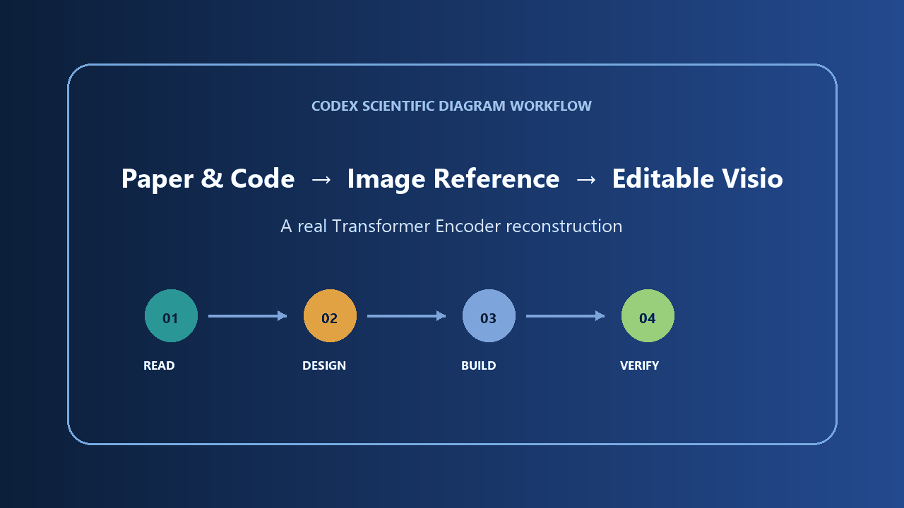
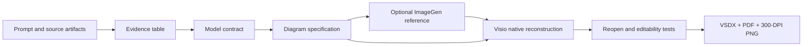

# Codex Scientific Diagram Visio

<p align="right">
  <strong>English</strong> | <a href="README.zh-CN.md">简体中文</a>
</p>

Turn model code, paper descriptions, and legacy figures into publication-ready Microsoft Visio diagrams made from native editable shapes.

The project separates scientific truth from visual design:

```text
Prompt + code + manuscript + old figure
                ↓
Evidence audit and tensor-shape contract
                ↓
Image-generated visual reference (optional)
                ↓
Native Visio reconstruction and local revision
                ↓
Reopen/editability QA + VSDX/PDF/300-DPI PNG
```

The generated image is a design reference, never the source of truth. Executed model shapes, training code, configuration, and manuscript equations are reconciled before drawing.

## Live workflow demo

This real Microsoft Visio capture shows Codex reading a verified Transformer Encoder contract, generating a style reference, constructing the figure from native shapes, reopening the VSDX, and selecting editable objects.



[Open the reproducible example](examples/transformer-encoder-demo/) · [Download the editable VSDX](examples/transformer-encoder-demo/assets/transformer-encoder-demo.vsdx) · [View PDF](examples/transformer-encoder-demo/assets/transformer-encoder-demo.pdf)

[Model and usage example](examples/transformer-encoder-demo/COST-EXAMPLE.md): approximately **$0.32 API-equivalent cost** for the documented `gpt-5.6-terra` + one medium `gpt-image-2` reference + local Visio scenario. Subscription message limits are not a fixed token-to-credit conversion.

## Why this exists

Scientific architecture figures often look polished while silently misrepresenting projection direction, fusion semantics, tensor dimensions, classifier width, or class count. This plugin adds an evidence gate before visual work and an editability gate after Visio export.

## Included skills

### `scientific-model-diagram-prompting`

- Inspect model code, configuration, manuscript text, screenshots, and old diagrams.
- Freeze stage order, operations, symbols, tensor dimensions, and class labels.
- Generate or revise a visual reference with definition-driven scientific icons.
- Produce a structured native-vector reconstruction specification.

### `scientific-model-diagram-visio`

- Rebuild or locally revise figures in Microsoft Visio.
- Use native editable containers, cuboids, operators, labels, and glued connectors.
- Enforce horizontal parallel branches, readable typography, consistent spacing, and collision-free routing.
- Reopen the VSDX, test independent object editability, and export PDF plus 300-DPI PNG.
- Inspect VSDX package structure with a bundled standard-library Python script.

## Requirements

- Codex with Agent Skills support.
- Windows and Microsoft Visio for native VSDX construction and GUI verification.
- Python 3.9+ for the optional read-only VSDX inspector.
- Image generation is optional; the Visio workflow can start from a verified written specification.

## Install

Install the versioned Codex plugin from this repository marketplace:

```powershell
codex plugin marketplace add CeobeFA333/codex-scientific-diagram-visio --ref v1.2.0
codex plugin add codex-scientific-diagram-visio@ceobefa-scientific-tools
```

Restart the Codex or ChatGPT desktop app and start a new thread. For a group rollout, send members the [bilingual trial guide](TEAM-TRIAL.md) or the `team-trial` ZIP attached to the release.

Alternative Agent Skills installation:

Install both skills with the open Agent Skills CLI:

```bash
npx skills add CeobeFA333/codex-scientific-diagram-visio
```

Or install a single skill in Codex from its GitHub directory:

```text
$skill-installer install https://github.com/CeobeFA333/codex-scientific-diagram-visio/tree/main/skills/scientific-model-diagram-prompting

$skill-installer install https://github.com/CeobeFA333/codex-scientific-diagram-visio/tree/main/skills/scientific-model-diagram-visio
```

Restart Codex after installation so the skills are discovered.

## Example prompts

Analyze before drawing:

```text
Use $scientific-model-diagram-prompting to compare my PyTorch model,
experiment config, manuscript equations, and old architecture figure.
Return the authoritative model contract, dimensional audit, and a
publication-ready visual-reference prompt.
```

Build a new editable figure:

```text
Use $scientific-model-diagram-visio to rebuild this verified model contract
as a native editable VSDX. Keep four parallel branches perfectly horizontal,
use separate operand and operator objects, glue every connector, and export
PDF plus a 300-DPI PNG after reopening and testing editability.
```

Revise only one region:

```text
Use $scientific-model-diagram-visio to back up this VSDX and modify only the
fusion and classifier stages. Preserve all unaffected objects and styles,
reroute adjacent connectors, and save a versioned revision.
```

## Architecture



Recommended production strategy:

1. Use deterministic scripts or Visio automation for page setup, repeated geometry, layers, and initial connectors.
2. Use Visio GUI control for visual refinement and collision repair.
3. Use static package inspection plus screenshots and reopened-object tests for final QA.

## VSDX inspection

The inspector is read-only and uses only the Python standard library:

```bash
python skills/scientific-model-diagram-visio/scripts/inspect_vsdx.py figure.vsdx --json
```

Optional checks:

```bash
python skills/scientific-model-diagram-visio/scripts/inspect_vsdx.py figure.vsdx --require-single-page --forbid-raster
```

Static inspection cannot prove that connectors are visually routed correctly or that text does not overlap. Reopen and screenshot-based QA remain mandatory.

## Quality principles

- Evidence before aesthetics.
- Model contract before image generation.
- Native shapes instead of a full-page bitmap.
- Explicit matrix convention and dimensional audit.
- Straight horizontal branches and reserved connector corridors.
- Operators remain independent from operands.
- No required text below 9 pt on a 16:9 publication page.
- Save, close, reopen, edit, export, and inspect before delivery.

## Platform scope

The analysis and prompting skill is portable across Agent Skills-compatible clients. Native Visio execution requires Windows and Microsoft Visio; other vector editors may reuse the model contract and visual specification but are outside the v1 support boundary.

## Security

This plugin may instruct an agent to read user-selected source files, control Microsoft Visio, and write outputs in a user-selected work directory. Review [SECURITY.md](SECURITY.md) before use. It does not require network access or credentials for VSDX inspection.

## License

MIT — see [LICENSE](LICENSE).

中文说明见 [README.zh-CN.md](README.zh-CN.md).
