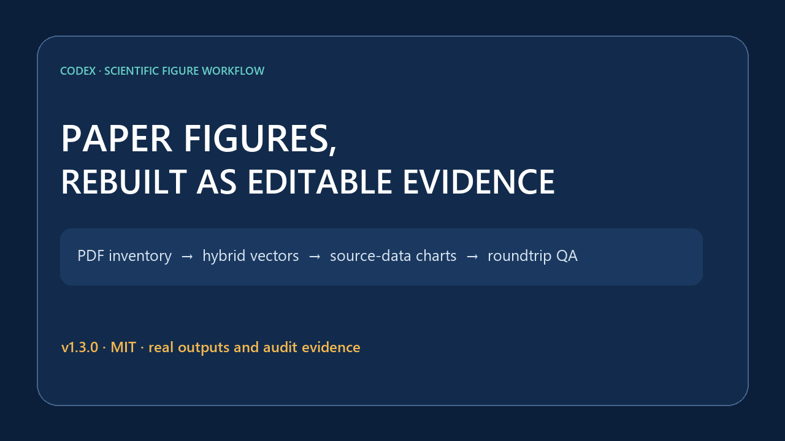
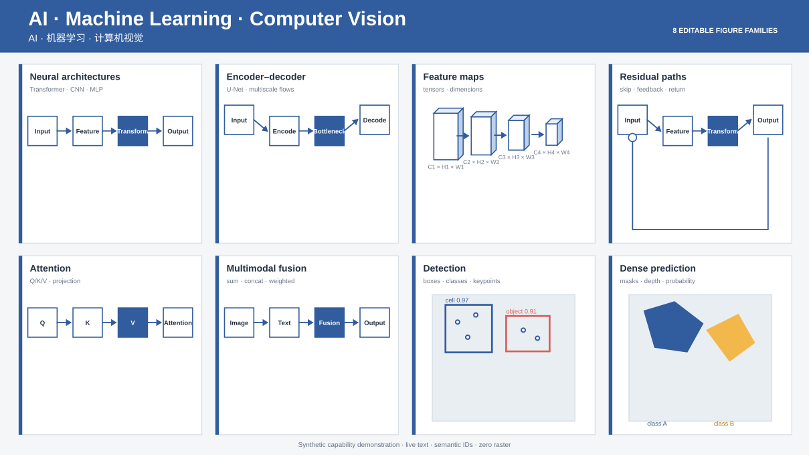
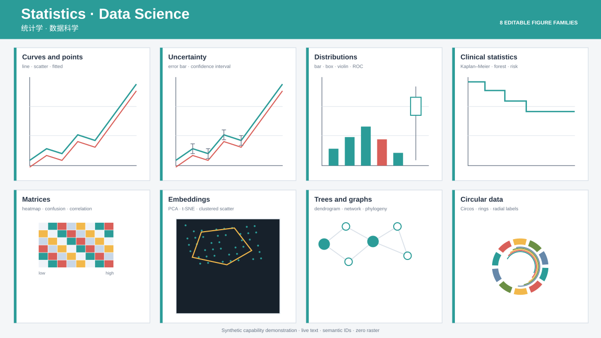
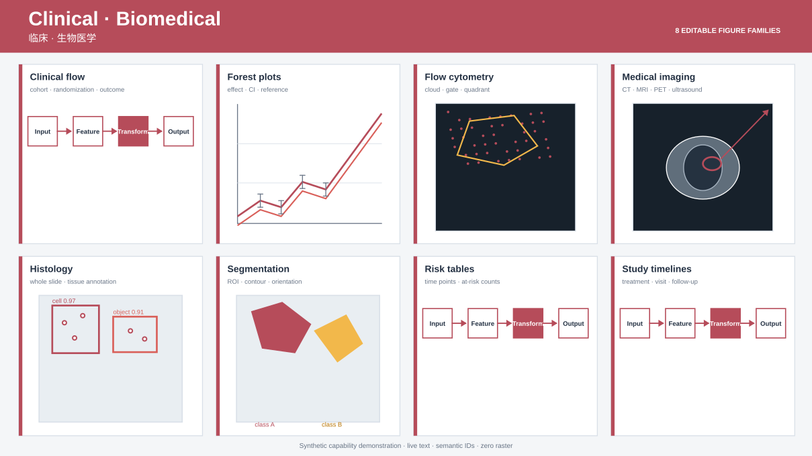
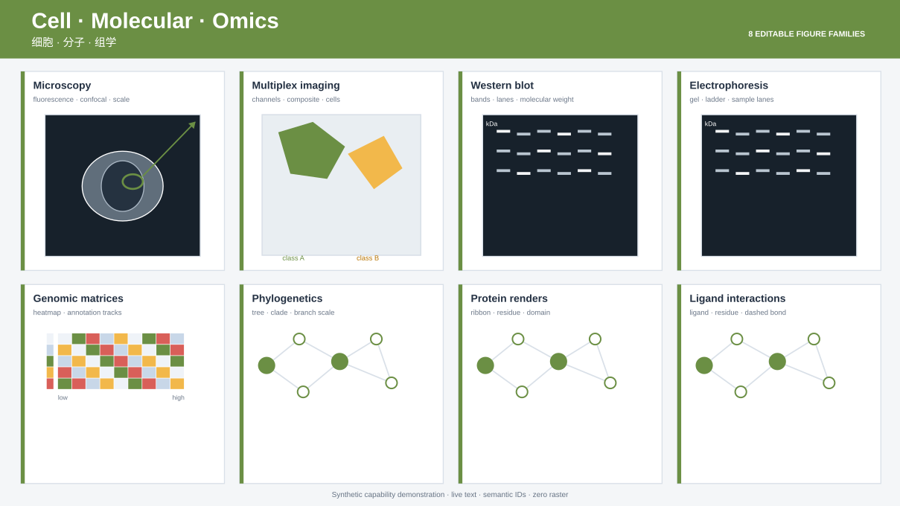
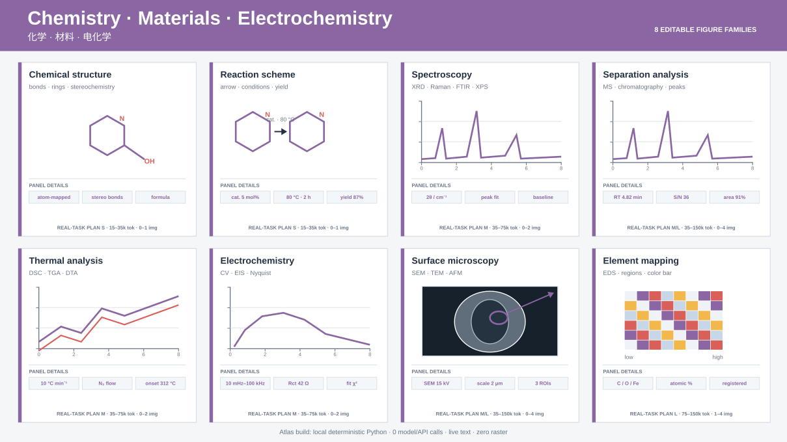
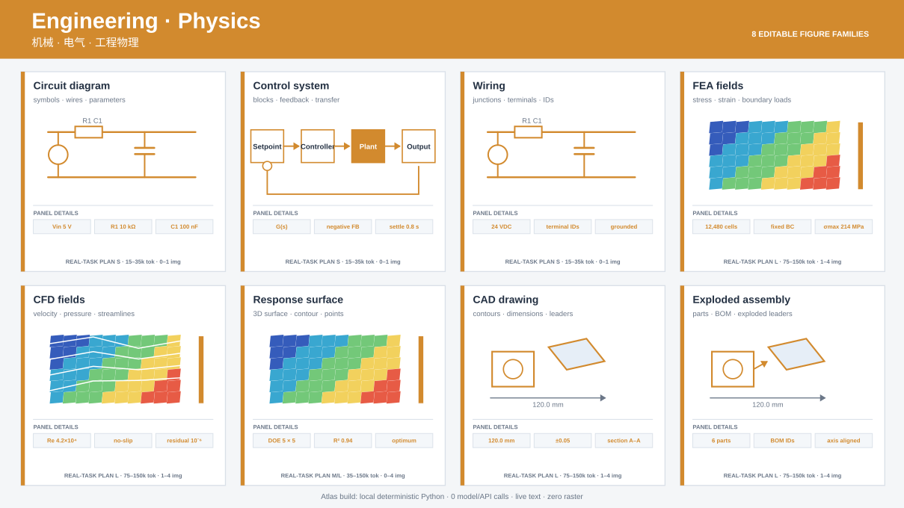
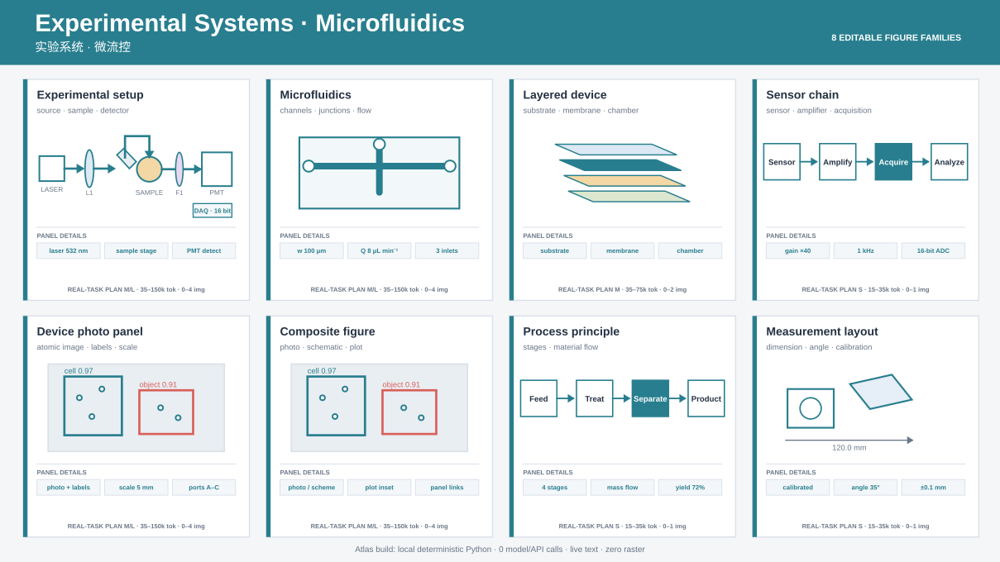
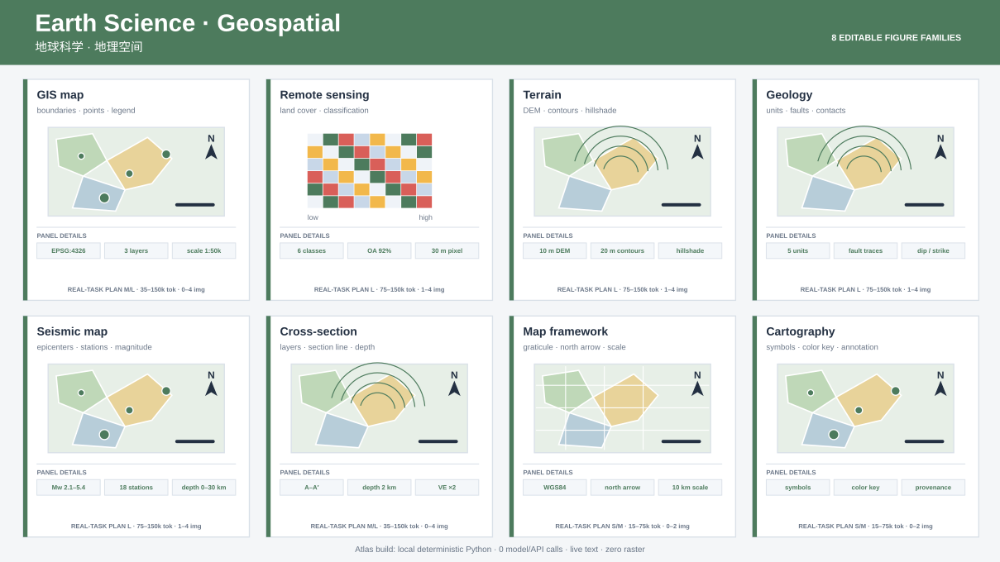

# Codex 科研模型图 Visio 工作流

<p align="right">
  <a href="README.md">English</a> | <strong>简体中文</strong>
</p>

将模型代码、论文 PDF、源数据和旧图转换为可编辑科研图，并用可复核证据约束交付质量。

核心流程：

```text
提示词 + 实验代码 + 论文 + 旧图
                ↓
证据核验与张量维度契约
                ↓
Codex 生图生成视觉参考（可选）
                ↓
Microsoft Visio 原生矢量重建或局部修改
                ↓
重新打开、可编辑性验收和导出检查
                ↓
VSDX + PDF + 300 DPI PNG
```

生成图片只用于布局和风格探索，不覆盖代码与公式确定的实际模型。

对于复杂多面板论文图，第三个技能走并行流程：先盘点 PDF 中的文本、矢量、图片和位置，再区分可重建几何与必须保真的科学像素，重建实时文字和矢量，最后核验 SVG、AI、可编辑 PDF 的往返证据与发表阻断项。

## 完整工作流动图

下面是真实 Microsoft Visio 窗口录制式演示：Codex 先读取并冻结 Transformer Encoder 模型契约，再用生图生成风格参考，随后以 Visio 原生形状逐步重建，保存并重新打开 VSDX，最后选择独立模块和已粘合连接线验证可编辑性。


[查看可复现示例](examples/transformer-encoder-demo/) · [下载可编辑 VSDX](examples/transformer-encoder-demo/assets/transformer-encoder-demo.vsdx) · [查看 PDF](examples/transformer-encoder-demo/assets/transformer-encoder-demo.pdf)

[模型与额度示例](examples/transformer-encoder-demo/COST-EXAMPLE.md)：在文档假设下，使用 `gpt-5.6-terra`、生成 1 张中等质量 `gpt-image-2` 参考图，再由本机 Visio 绘制，API 等价成本约为 **0.32 美元**。ChatGPT/Codex 套餐消息额度不等于固定的 token 换算比例。

## 论文图片重建能力演示

下面的 v1.3.2 动图直接采用真实重建产物与审计数值，展示十面板混合生物医学图、可编辑统计图组、受限 OCR 清理，以及 Illustrator 三阶段重开计数。它是“真实产物 + 真实证据”组成的能力演示，不冒充 Illustrator 界面录屏。



[查看完整示例与来源说明](examples/paper-figure-reconstruction-demo/) · [观看 MP4](examples/paper-figure-reconstruction-demo/assets/paper-figure-reconstruction-demo.mp4) · [检查证据 JSON](examples/paper-figure-reconstruction-demo/assets/simpli-figure4-evidence.json)

## 64 类图型能力图谱

下面 8 张分类图由本仓库真实的 `reconstruct-paper-figures` 配方构建器在本机生成，共包含 **64 个细分图型演示**。所有卡片都保留实时文字、语义对象 ID 和可编辑矢量几何，并记录配方/SVG 哈希；结构审计结果为 **0 个嵌入栅格节点**。每张卡片现在还带有接近论文面板的参数细节和真实任务消耗规划。它们是合成的能力测试，不是“已经逐像素复刻了 64 篇来源论文”的宣传。

卡片中的消耗档位为 `S`、`M`、`L`，或可条件升级的 `S/M`、`M/L`；对应真实重建任务约 **1.5 万—15 万 Agent token** 和 **0—4 次可选视觉参考生图**。它只是依据源图质量、科学校验、编辑器往返和返工量给出的规划区间，不是价格或额度保证。生成这套图谱本身只运行确定性本地 Python，消耗为 **0 次模型/API 调用**。

| AI / 计算机视觉 | 统计学 / 数据科学 |
|---|---|
| [](examples/capability-atlas/assets/ai-computer-vision.svg) | [](examples/capability-atlas/assets/statistics-data-science.svg) |
| 临床 / 生物医学 | 细胞 / 分子 / 组学 |
| [](examples/capability-atlas/assets/clinical-biomedical.svg) | [](examples/capability-atlas/assets/cell-molecular-omics.svg) |
| 化学 / 材料 / 电化学 | 工程 / 物理 |
| [](examples/capability-atlas/assets/chemistry-materials.svg) | [](examples/capability-atlas/assets/engineering-physics.svg) |
| 实验系统 / 微流控 | 地球科学 / 地理空间 |
| [](examples/capability-atlas/assets/experimental-systems.svg) | [](examples/capability-atlas/assets/earth-geospatial.svg) |

[查看分类画廊、配方与生成器](examples/capability-atlas/) · [检查 64 类清单和 SHA-256 证据](examples/capability-atlas/capability-manifest.json)

## 支持的科研领域与图型

这里的“支持”是指：能够识别面板类型、选择不破坏科学证据的重建路线，并输出可编辑规范或产物。它不等于所有像素图都能无损全矢量化；最终能否用于发表，仍取决于源数据、标定信息与人工科学审核。

| 科研领域 | 可处理的图型 | 当前重建路线 |
|---|---|---|
| AI、机器学习与计算机视觉 | 神经网络架构、Transformer/CNN/U-Net、编码器-解码器、多模态流程、特征图、残差/跳连、检测框、类别与置信度、关键点、分割掩膜、深度图和概率图 | 架构几何使用 Visio 原生对象；含科学图像的定性结果使用混合 SVG |
| 统计学与数据科学 | 折线、散点、拟合曲线、误差棒、柱状、箱线、小提琴、ROC、Kaplan-Meier、森林图、风险表、热图、混淆/相关矩阵、PCA、t-SNE、聚类树、网络、系统发育树和 Circos 环形图 | PDF 原生几何或源数据存在时全矢量重建；数字化曲线必须明确标记为近似数据 |
| 临床与生物医学 | 临床流程、生存曲线、森林图、流式细胞门、CT/MRI/PET/超声叠加图、组织学与全切片标注 | 在不可变科学图像原子上重建门、ROI、标尺、图例与实时文字 |
| 细胞、分子与组学 | 荧光/共聚焦显微、多重成像、Western blot、电泳、基因组热图、系统发育图、蛋白质/配体渲染标注 | 保留强度、组织、条带或分子渲染像素；重建标注与数据绑定图层 |
| 化学、材料与电化学 | 化学结构/反应式，XRD、Raman、FTIR、XPS、质谱、色谱，DSC/TGA/DTA，CV/EIS/Nyquist，SEM/TEM/AFM/EDS | 重建曲线、峰、坐标、化学键、反应箭头、条件、标尺和标注；必要时保留仪器像素 |
| 机械、电气与工程物理 | 电路/控制/接线图、FEA 应力应变场、CFD 速度/压力/流线、3D 响应面/等高线、CAD 与爆炸装配图 | 在连续场或渲染图周围重建框架、符号、尺寸、引线、边界、载荷箭头和色标 |
| 实验系统与微流控 | 实验装置、过程原理、通道、层、流路、传感器、设备照片，以及照片+示意图+曲线的混合多面板图 | 可编辑框架+最小原子化照片/显微区域，未解决的测量问题保留为阻断项 |
| 地球科学与地理空间 | GIS/遥感、土地覆盖、地形/DEM、地质/地震地图、断层、震中、剖面、经纬网、指北针、比例尺和图例 | 在卫星、地形或连续栅格证据上重建可编辑地图叠加层 |

每个面板都会记录恢复等级：`R0` 为 PDF 原生几何，`R1` 为源数据重生，`R2` 为近似数字化，`R3` 为必须保留的科学像素。同一张混合图可以同时使用多个等级。

## 可绘制的对象、符号与科研图标

项目不依赖封闭图标库，而是使用明确的矢量原语和语义 ID 组合成可复用、可编辑科研组件。

| 组件类别 | 可绘制对象与图标 |
|---|---|
| 基础矢量原语 | 矩形/圆角矩形、椭圆/圆、三角形/四边形/多边形、直线/折线、三次曲线与圆弧路径、开放/闭合圆弧、环形扇区、嵌套组、线性/径向渐变、实时文字、曲线路径文字、上下标格式 |
| 流程与关系符号 | 直线/正交箭头、粘合连接线、双向尺寸/离散度箭头、分支、合并、残差/跳连、反馈/回路、引线、括号、边界、ROI 框、虚线围栏、结点和检查点 |
| AI/模型架构组件 | 可编辑 3D 张量/特征图方块、输入/输出块、编码器/解码器、投影与权重矩阵、偏置/向量块、注意力、归一化、卷积/池化、分类头、平行分支和多模态融合 |
| 数学运算符 | 独立的 `×`、`+`、`Σ`、拼接 `‖`、箭头、等号与公式文字；矩阵、维度、希腊字母、prime（撇号）、上下标可独立编辑 |
| 统计缩略图 | 按定义区分的均值、方差、偏度、峰度图标；坐标、刻度、网格、点、误差棒、置信区间、删失标志、拟合曲线、图例、显著性括号和 p 值文字 |
| 矩阵、网络与环形组件 | 热图单元格、混淆/相关单元格、树状图分支、图节点/边、系统发育分支、同心环、环形扇区、环形文字和色标 |
| 图像与测量叠加层 | 面板字母、通道名、比例尺、方向标记、ROI 多边形、分割边界、门/象限、箭头、关键点、类别/置信度、峰标记和参考线 |
| 实验装置与工程组件 | 过程容器、管道/通道、流向箭头、电路连线、结点、仪器方块、边界/载荷箭头、尺寸线、剖面标记、爆炸图引线和 BOM 编号 |
| 化学与分子组件 | 化学键、环、立体化学楔形、反应箭头、条件/产率文字、残基/配体标注、虚线相互作用键；尚未内置理解化学语义的 ChemDraw/RDKit 后端 |
| 地图组件 | 边界、点、剖面线、经纬网、指北针、比例尺、图例、断层迹线和震中符号；尚未内置坐标感知的 GIS 导入后端 |

## 支持的绘图工具与后端

| 工具/后端 | 当前能力 | 验证状态 |
|---|---|---|
| Microsoft Visio | 在 Windows 上打开并控制 Visio，生成原生形状/组/连接线，保存 VSDX，重开对象，验证粘合与保真度，导出 SVG/PDF/PNG | **已验证原生运行时**：桌面 Visio 16.0 |
| Adobe Illustrator | 运行 JSX 脚本完成 SVG 导入、AI 保存/重开、可编辑 PDF 导出/重开、对象/字体/路径审计和受限路径文字修复 | **已验证往返**：Windows + Illustrator 29.8.2 |
| SVG + 可编辑 PDF | 不依赖 Visio 生成可编辑 SVG、混合矢量/栅格组合、实时文字、物理尺寸、哈希和结构审计 | **便携核心已实现**；最终仍需目标编辑器人工验收 |
| draw.io / diagrams.net | 将受支持的 SVG 子集转成含稳定 ID、图层、纯文本、连接线、清单和失败关闭审计的可编辑 `mxGraphModel` | **结构适配器已实现**；真实导入/保存/关闭/重开验收待完成 |
| Scientific Illustrator | 可产生适合框架图的后端中立场景，对接其已公开的 draw.io/PowerPoint 方向 | **已记录集成契约**；本仓库没有内置或宣称其运行时已验证 |
| PowerPoint / WPS | 可通过 Scientific Illustrator 兼容流程作为中间框架编辑器 | **尚无直接控制器**；发表验收需回到 SVG/Illustrator QA |
| Inkscape、Figma、Affinity Designer、CorelDRAW | 理论上可按各自兼容性打开导出的 SVG/PDF | **当前未自动化、未回归测试** |
| ChemDraw/RDKit、PyMOL/ChimeraX、CAD/GIS 工具 | 作为化学、分子渲染、装配与地图的领域语义后端 | **已规划，尚未实现** |

## 三个技能

### `scientific-model-diagram-prompting`

- 读取模型代码、训练配置、论文、截图和旧图。
- 核对流程、公式、投影方向、融合方式、维度与类别数。
- 生成科研模型图设计提示词和视觉参考图。
- 输出 Visio 原生重建所需的结构化规范。

### `scientific-model-diagram-visio`

- 使用 Microsoft Visio 完整重建或局部修改 VSDX。
- 使用原生可编辑容器、3D 方块、运算符、标签和连接线。
- 保持平行分支水平、等距，避免文字、形状和连接线重叠。
- 保存后关闭并重新打开，测试方块、符号、标签和连接线是否可独立编辑。
- 导出 PDF 与至少 300 DPI PNG，并检查裁切、字体和阴影。

### `reconstruct-paper-figures`

- 编辑前盘点 PDF 的文本、矢量、图片、位置、图注和有效 PPI。
- 重建实时文字与可编辑 SVG，把连续色调科研证据保留为最少、哈希绑定的图片原子。
- 根据出版方源数据重建统计图；缺失分组或观测值时不臆造数据。
- 只执行人工复核后的 OCR 清理计划，逐像素审计变更，并保留人工批准门槛。
- 为 SVG 导入、Illustrator AI 重开和可编辑 PDF 重开生成机器可读的对象与哈希证据。
- 适合时输出 draw.io/Visio 框架几何，但不混淆各编辑器的最终验收边界。

## 安装

推荐通过本仓库的版本化 Marketplace 安装 Codex Plugin：

```powershell
codex plugin marketplace add CeobeFA333/codex-scientific-diagram-visio --ref v1.3.2
codex plugin add codex-scientific-diagram-visio@ceobefa-scientific-tools
```

安装后重启 Codex 或 ChatGPT 桌面端，并新建对话。课题组试用时，可直接分享[中英双语试用指南](TEAM-TRIAL.md)，或 Release 中的 `team-trial` 压缩包。

也可以使用 Agent Skills 方式安装：

通过开放 Agent Skills CLI 安装：

```bash
npx skills add CeobeFA333/codex-scientific-diagram-visio
```

也可以在 Codex 中分别从 GitHub 安装三个技能：

```text
$skill-installer install https://github.com/CeobeFA333/codex-scientific-diagram-visio/tree/main/skills/scientific-model-diagram-prompting

$skill-installer install https://github.com/CeobeFA333/codex-scientific-diagram-visio/tree/main/skills/scientific-model-diagram-visio

$skill-installer install https://github.com/CeobeFA333/codex-scientific-diagram-visio/tree/main/skills/reconstruct-paper-figures
```

## 适用场景

- 根据 PyTorch/TensorFlow 代码重建论文模型图。
- 检查论文描述和实际训练模型是否一致。
- 将生图得到的参考图转换为原生可编辑 Visio。
- 修改现有 VSDX 中某个阶段、维度、公式、字体或连接线。
- 检查多页、嵌入位图、原生形状、分组和连接记录。
- 将复杂论文图重建为可编辑 SVG、AI 和 PDF，同时保留必须的科学像素证据。
- 根据出版方源数据重建统计图，或对已复核文字执行受限像素清理。

## v1.3 支持范围

- 模型证据核验和设计提示词可以跨平台使用。
- 原生 VSDX 构建需要 Windows 和 Microsoft Visio。
- PDF 盘点、SVG 构建和源数据准备可跨平台运行，但需要技能文档列出的 Python 依赖。
- AI/可编辑 PDF 三阶段往返已经在 Windows + Adobe Illustrator 29.8.2 上验证；其他版本不在当前验证承诺内。

## 安全边界

技能可能要求 Agent 读取用户指定的论文、图片、源数据和代码，控制 Visio 或 Illustrator，并在指定工作目录中保存文件。打包技能本身不会把这些材料上传给项目维护者，也不需要密码或令牌。运行公开第三方 Skill 前仍应阅读其内容和脚本。

许可证：MIT。
